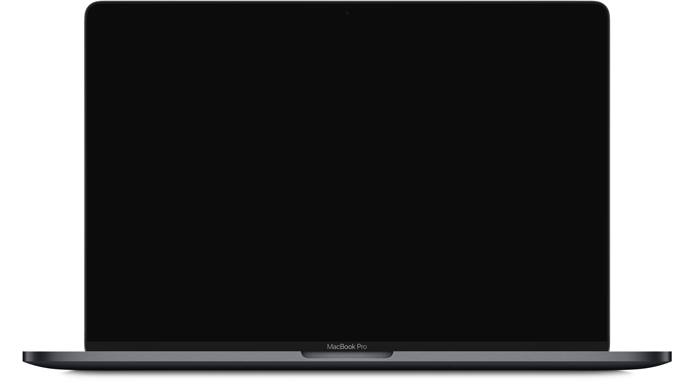

  
Millefeuille

  Layers of financial goodness.

<h1 align="center">
  Personal Finance Manager
</h1>

Millefeuille ~~is~~ will be an open source personal financial management system.

This screen is black because Millefeuille the open source personal financial management system doesn't exist yet :+1::+1:

- [Introduction](#introduction)
- [Documentation](#Documentation)

## Introduction

Millefeuille is a budget management web app that I'm building for myself but you can use it if you want to (when it exists). Originally, this was essentially just a bunch of SQL scripts and random javascript snippets hastily put together that broke every time.

This new one will work better because we'll do it **Properly This Time™**.

## [Documentation](docs/)

- [Concept](docs/concept)
- [Tech Stack](docs/tech-stack)

---

Copyright (c) <a href="https://legendofcode.com">Legend of Code</a> 2019

